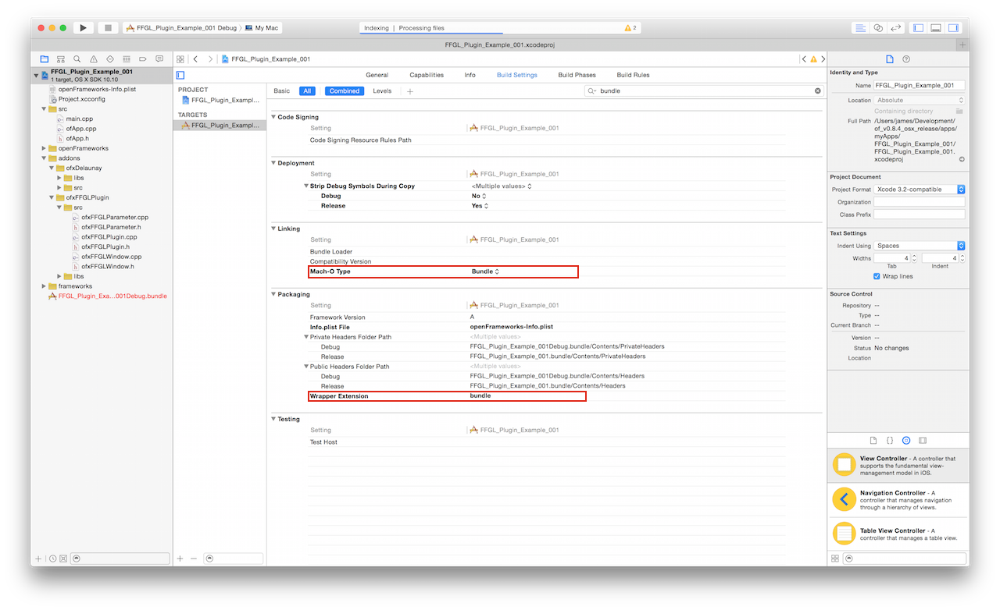
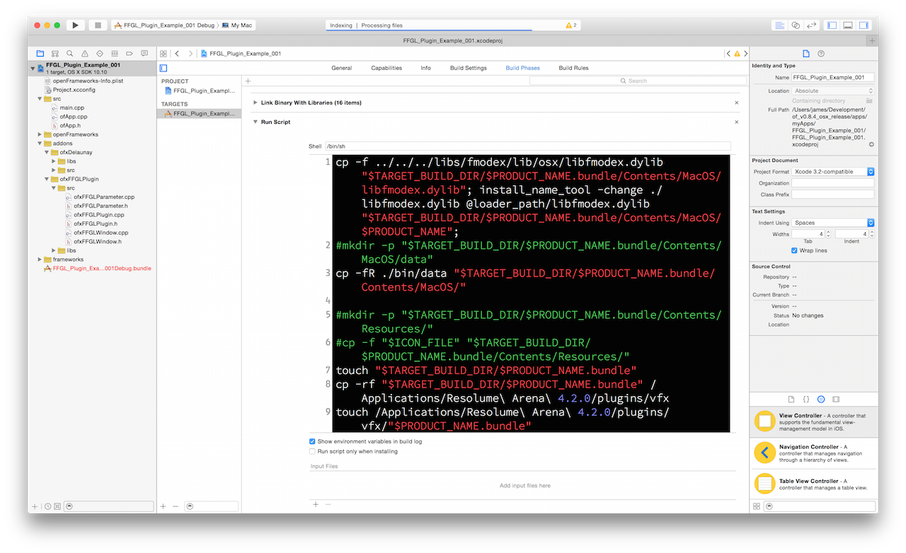

# FFGL_Plugin_Example_001

##setup

* launchprojectgenerator 
* add dependencies
* modify project setting
* 
* 

##dependencies

* [ofxFFGLPlugin](https://code.google.com/p/ofxffglplugin/)
* [ofxDelaunay](https://github.com/obviousjim/ofxDelaunay)

##preview
